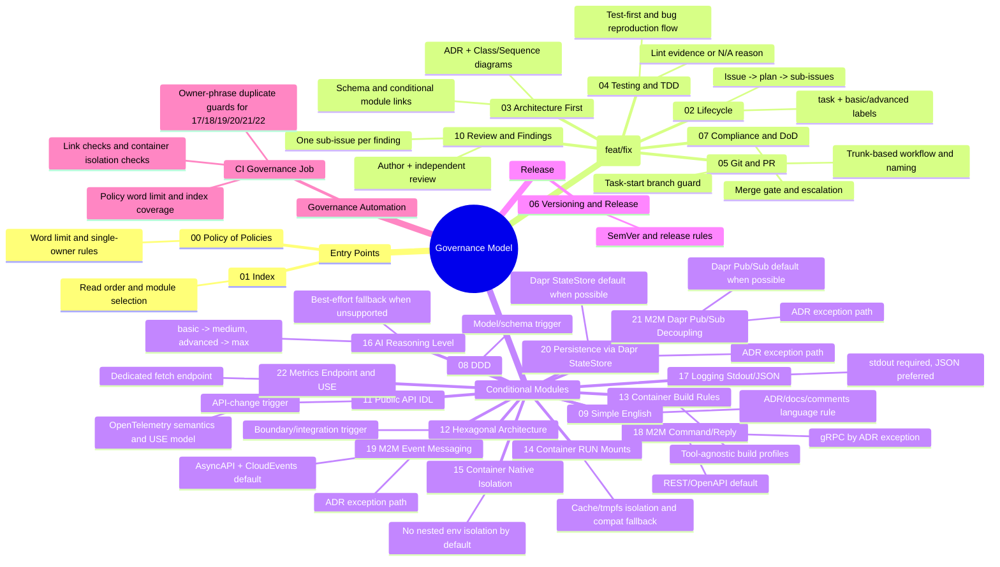

# Governance Structure Mindmap

- Parent issue: N/A - governance documentation update
- ADR: N/A - policy-level governance overview
- Purpose: Visual overview of policy modules and governance flow.

