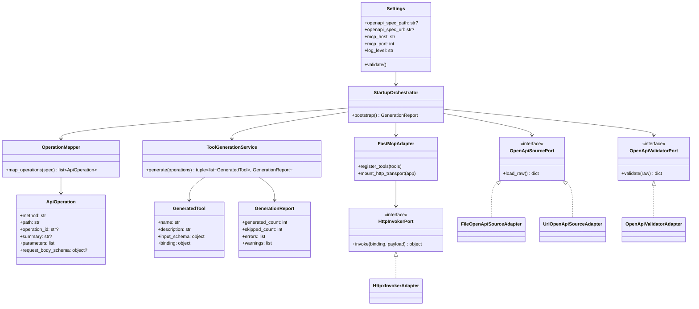

# Class Diagram - Bootstrap Core

- Parent issue: [#1](https://github.com/Albe83/openapi-to-mcp/issues/1)
- ADR: [docs/adr/0001-python-fastapi-fastmcp-bootstrap.md](../adr/0001-python-fastapi-fastmcp-bootstrap.md)
- Purpose: Show the core domain, ports, and adapters for startup and runtime mapping.

