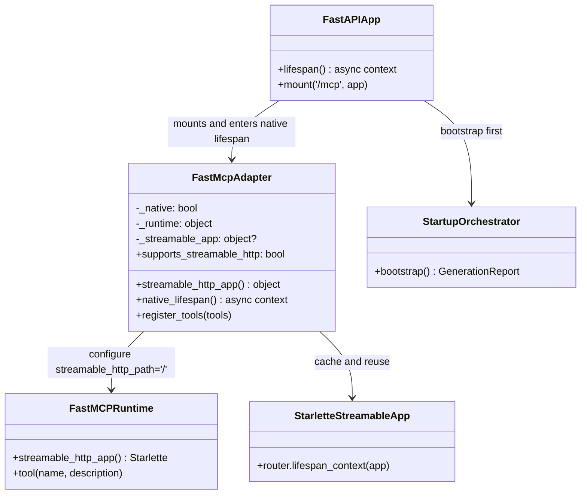

# Class Diagram - Streamable Lifecycle Fix

- Parent issue: [#19](https://github.com/Albe83/openapi-to-mcp/issues/19)
- ADR: [docs/adr/0002-fix-streamable-native-lifespan.md](../adr/0002-fix-streamable-native-lifespan.md)
- Purpose: Show transport classes and lifecycle coordination for native streamable mode.

