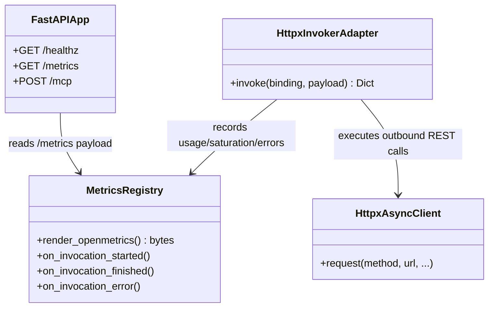

# Class Diagram: Metrics Observability Components

- Parent issue: [#22](https://github.com/Albe83/openapi-to-mcp/issues/22)
- ADR: [docs/adr/0003-metrics-endpoint-opentelemetry-use-alignment.md](../adr/0003-metrics-endpoint-opentelemetry-use-alignment.md)
- Purpose: Show runtime components used to collect and expose metrics.

