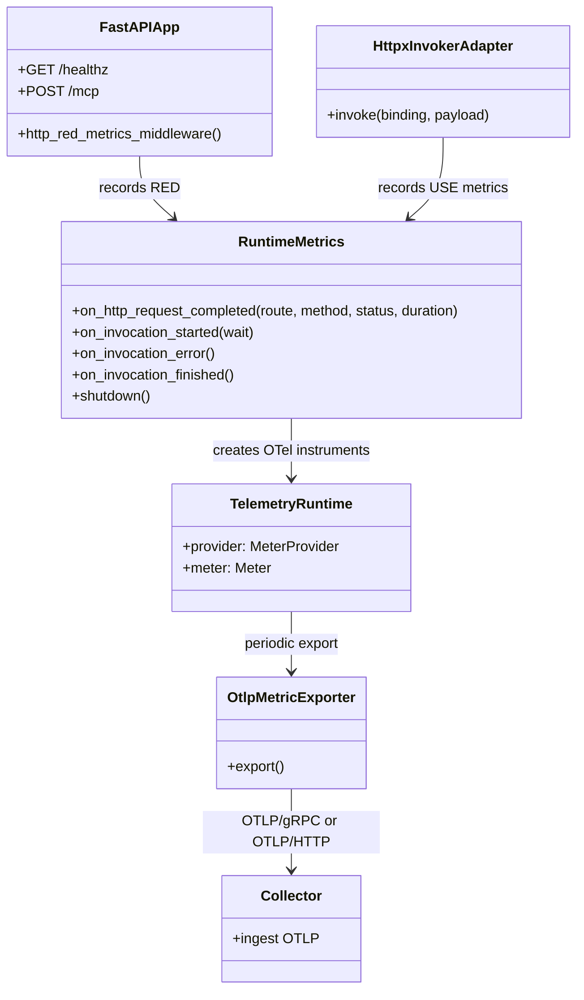

# Class Diagram: OTLP Telemetry and RED/USE Metrics

- Parent issue: #TBD
- ADR: [docs/adr/0004-otlp-telemetry-red-use-and-metrics-deprecation.md](../adr/0004-otlp-telemetry-red-use-and-metrics-deprecation.md)
- Purpose: Show telemetry components and RED/USE instrumentation with OTLP-only export.

