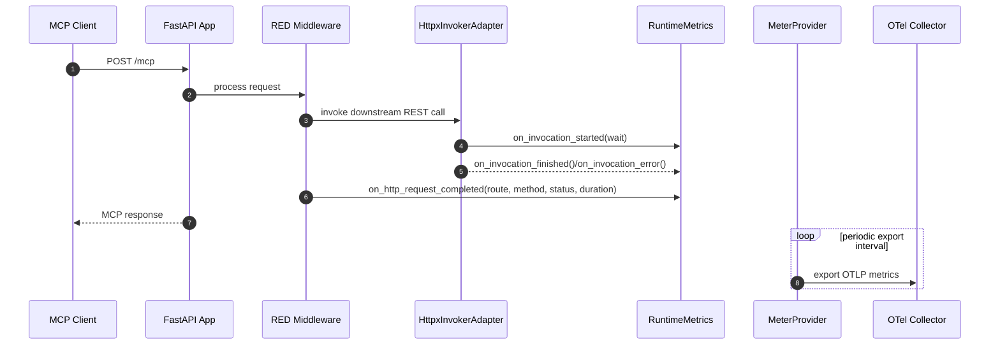

# Sequence Diagram: HTTP RED Collection and OTLP Export

- Parent issue: #TBD
- ADR: [docs/adr/0004-otlp-telemetry-red-use-and-metrics-deprecation.md](../adr/0004-otlp-telemetry-red-use-and-metrics-deprecation.md)
- Purpose: Describe request instrumentation, outbound USE updates, and periodic OTLP export.

