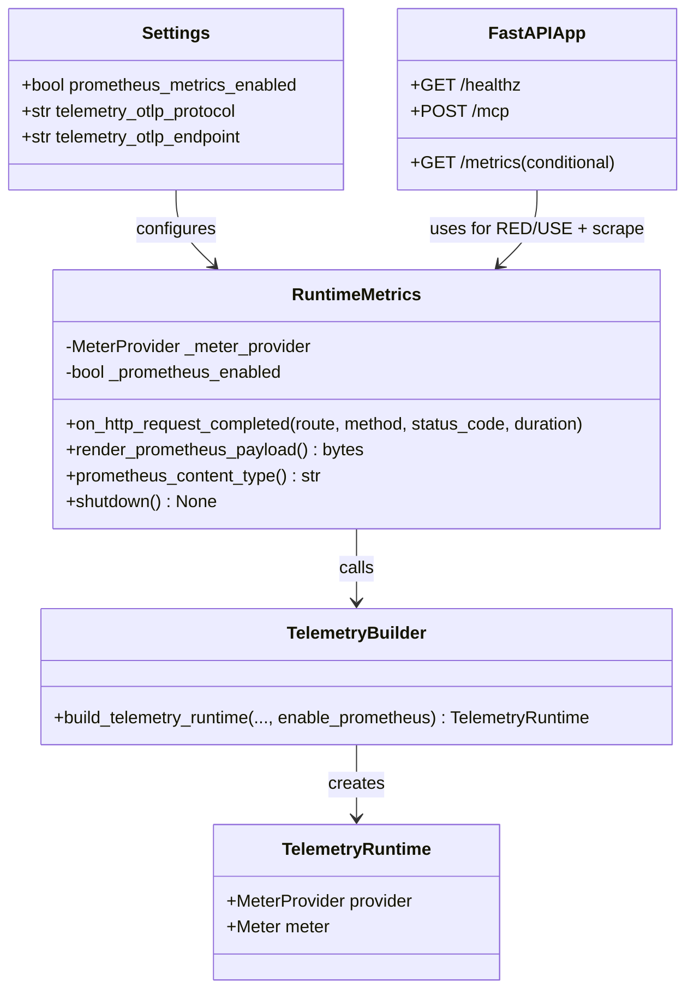

# Class Diagram: Optional Prometheus Compatibility Telemetry

Purpose: Describe runtime components and dependencies for OTLP default telemetry plus optional Prometheus-compatible exposition.
Parent issue: #59
ADR reference: [docs/adr/0005-optional-prometheus-compatibility-toggle.md](../adr/0005-optional-prometheus-compatibility-toggle.md)

