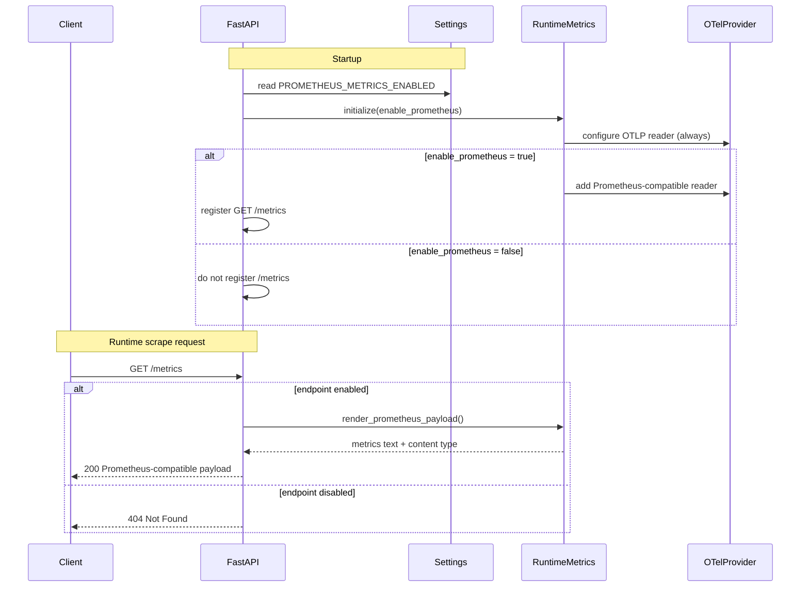

# Sequence Diagram: Conditional Metrics Scrape Flow

Purpose: Show request behavior for `/metrics` when Prometheus compatibility is enabled or disabled.
Parent issue: #59
ADR reference: [docs/adr/0005-optional-prometheus-compatibility-toggle.md](../adr/0005-optional-prometheus-compatibility-toggle.md)

