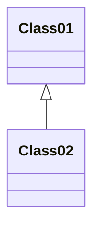

# Mermaid Diagram Guidelines

This directory stores mandatory architecture diagrams as Markdown Mermaid files.

## Diagram as Code Standard
- Use Markdown files only: `NNNN-short-title.md`.
- Required architecture diagrams must be embedded in fenced ` ```mermaid ` blocks.
- `.mmd` files are not valid for mandatory architecture artifacts.
- Diagrams must render directly in GitHub UI.

## Required Diagram Set (Feature/Bugfix)
- Class Diagram (required).
- Sequence Diagram (required).

## Location Rule
- Diagram files must be stored in this directory (`docs/diagrams/*.md`).
- ADRs must link to the required class and sequence diagram files.
- Reference diagram file paths in sub-issues and PRs.

Recommended naming:
- `NNNN-class-<scope>.md`
- `NNNN-sequence-<scope>.md`

## Minimum Metadata per Diagram File
- Parent issue reference.
- Related ADR reference.
- Brief purpose statement.

## Markdown Template
````md
# <Diagram Title>

- Parent issue: #123
- ADR: docs/adr/0001-<title>.md
- Purpose: <short description>


````

## Process
1. Create/update class and sequence diagrams before implementation tasks.
2. Keep diagrams in dedicated Markdown files; do not place diagrams inside ADR files.
3. Link both diagram file paths in ADR, sub-issues, and PRs.
4. Update diagrams first when architecture decisions change.
